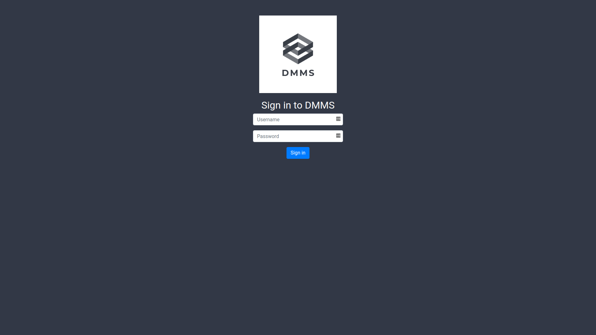
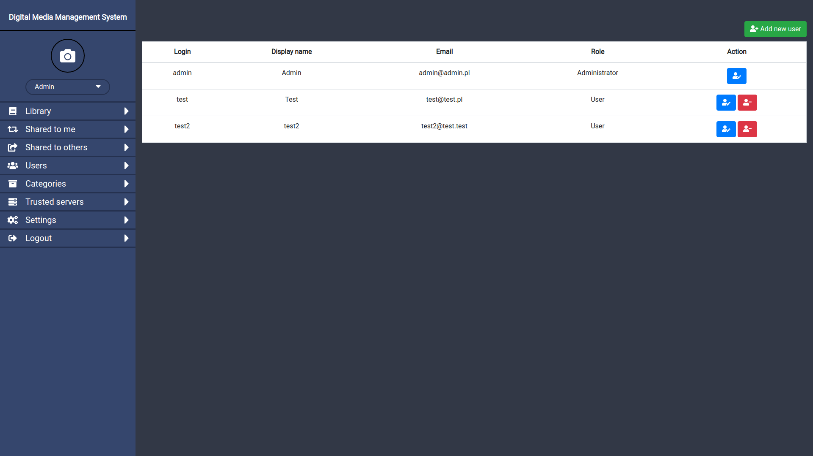
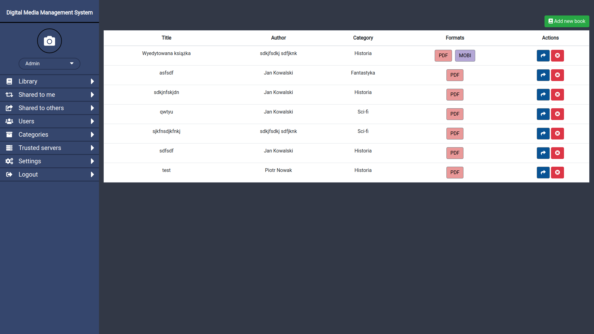
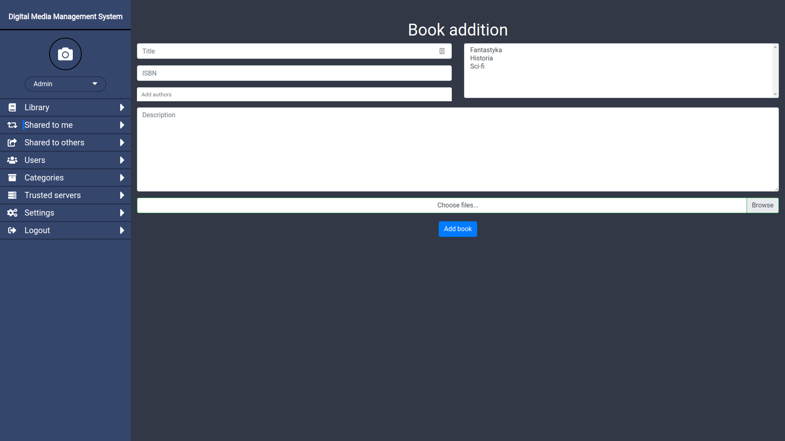
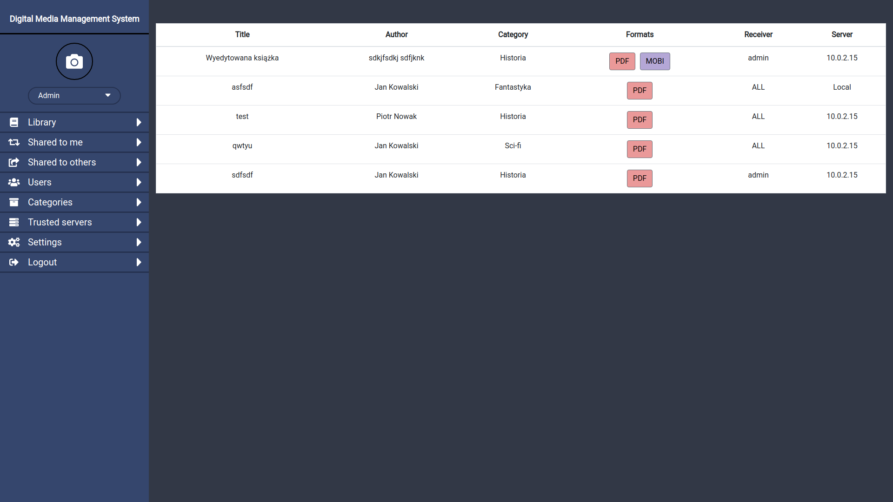
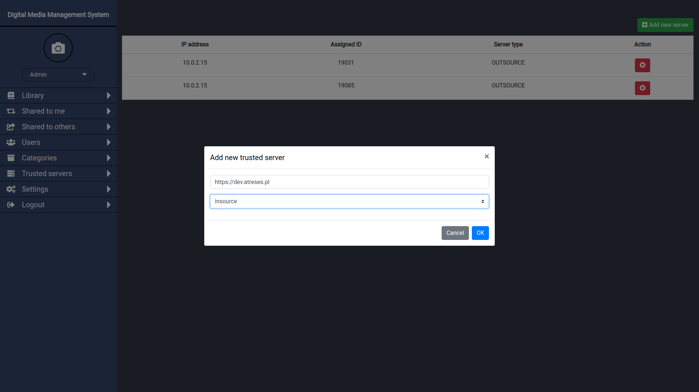
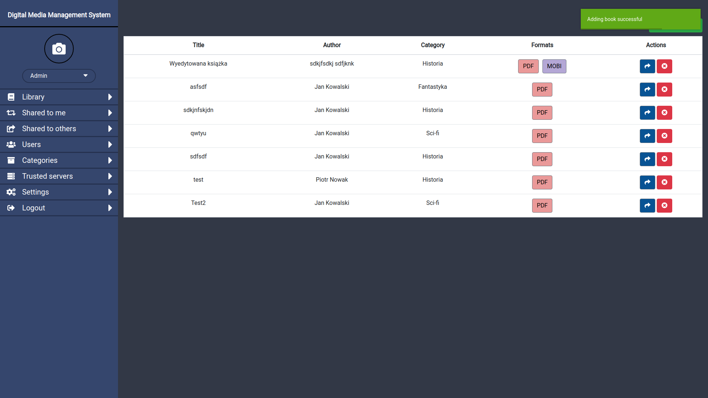

# dmms-ui-web
This repository holds Web UI implementation of DMMS application.

## Functions Overview
DMMS supports following features:

* authorization and user management



* book management



* book sharing



* notifications system


## Build Setup

``` bash
# install dependencies
npm install

# serve with hot reload at localhost:8080
npm run dev

# build for production with minification
npm run build

# build for production and view the bundle analyzer report
npm run build --report
```

## Current functionality
- Authorization (login, logout)
- User management (display, addition, edition, deletion)
- Book management (display, addition, downloading)

## Components responsibility
- layout:
  - `MenuItem.vue` - sidebar menu item with icon
  - `MenuList.vue` - sidebar menu item list
  - `Sidebar.vue` - sidebar layout
  - `UserDetails.vue` - sidebar user login and photo
  - `LoginForm.vue` - login form with logo
  - `DownloadButtons.vue` - book download buttons (book list and book details)

- form helpers:
  - `InputSimple.vue` - simple wrapped bootstrap input
  - `TagsInput.vue` - wrapper vue-tags-input
  - `PropDetailTable.vue` - property table used in book details

- user management:
  - `RoleSelector.vue` - user role selector input
  - `UserDetailsModal.vue` - user addition modal
  - `UserEditModal.vue` -  user edition modal
  - `UserList.vue` - list of users
  - `UserManagement.vue` - table with users list and 'Add new user' button
  
- book management:
  - `BookAddForm.vue` - book addition form
  - `BookDetails.vue` - book details component
  - `BookList.vue` - list of books
  - `Library.vue` - component with book list and 'Add new book' button

- share:
  - `SharedToMe.vue` - list of books shared to current user. Introduced book download
  - `SharedToOthers.vue` - list of books that current user shares to others
